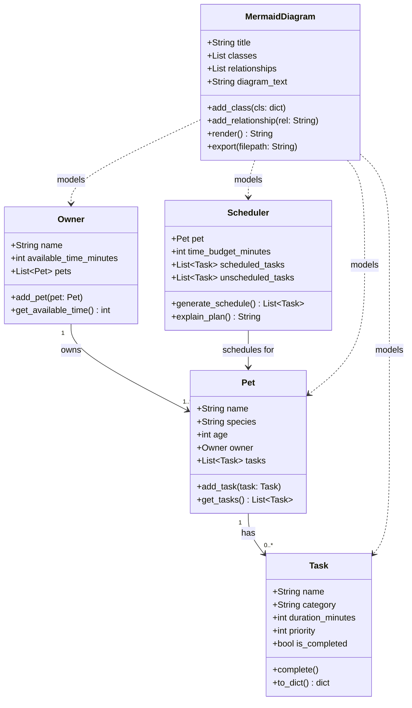

# PawPal+ Project Reflection

## 1. System Design

**a. Initial design**

Three core actions a user should be able to perform in PawPal+:

1. **Enter owner and pet information** — The user provides basic details about themselves and their pet. This information acts as the foundation for all scheduling decisions, since the amount of time available and the pet's needs directly constrain which tasks can be included in a given day.

2. **Add and edit care tasks** — The user can create tasks representing individual care activities (such as a morning walk, feeding, medication, grooming, or enrichment play). Each task carries at minimum a duration and a priority level so the scheduler knows how long it takes and how important it is relative to other tasks. 

3. **Generate and view a daily schedule** — The user triggers the scheduler, which takes the defined tasks and constraints and produces an ordered daily plan. The app displays the resulting schedule clearly and explains why tasks were included or excluded, helping the owner understand and trust the plan.

The system is built around five classes:

| Class | Attributes | Methods |
|---|---|---|
| `Owner` | `name`, `available_time_minutes`, `pets` | `add_pet()`, `get_available_time()` |
| `Pet` | `name`, `species`, `age`, `owner`, `tasks` | `add_task()`, `get_tasks()` |
| `Task` | `name`, `category`, `duration_minutes`, `priority`, `is_completed` | `complete()`, `to_dict()` |
| `Scheduler` | `pet`, `time_budget_minutes`, `scheduled_tasks`, `unscheduled_tasks` | `generate_schedule()`, `explain_plan()` |
| `MermaidDiagram` | `title`, `classes`, `relationships`, `diagram_text` | `add_class()`, `add_relationship()`, `render()`, `export()` |

**Relationships:**
- An `Owner` owns one or more `Pet` objects.
- A `Pet` holds a list of `Task` objects representing its care needs.
- A `Scheduler` is given a `Pet` and produces a filtered, prioritized daily plan.
- A `MermaidDiagram` composes any set of classes and relationships and renders them as diagram text.

**Class responsibilities:**

- **`Task`** (dataclass) — the atomic unit of pet care. It knows its own name, category, duration, and priority, and can mark itself completed or serialize itself to a dictionary. Keeping it a dataclass makes it easy to create, compare, and pass around.

- **`Pet`** (dataclass) — the subject of all care. It holds identity information (name, species, age) and owns the list of tasks that need to be done for it. It also carries a back-reference to its `Owner` so the scheduler can always trace from pet → owner → time budget.

- **`Owner`** — the constraint-holder. Its key responsibility is storing the total daily time available, which becomes the scheduler's budget. It also acts as the registration point for pets, enforcing the back-link between a pet and its owner.

- **`Scheduler`** — the decision-maker. Given a pet (and, transitively, its tasks and time budget), it sorts tasks by priority, fits as many as possible into the available time, and separates the rest into an unscheduled list. It also produces a plain-English explanation of its choices.

- **`MermaidDiagram`** — a design/documentation utility, not a runtime component. It accumulates class definitions and relationship strings and can render them into a valid Mermaid `classDiagram` block, or export that block to a Markdown file.

**Mermaid.js class diagram:**

**b. Design changes**

After reviewing the skeleton, two problems were identified and fixed:

1. **Added `Pet.remove_task()`** — The original design omitted a way to remove tasks from a pet. Since "add and edit tasks" is one of the three core user actions, deleting a task is essential. A `remove_task(task_name: str)` stub was added to `Pet` to close this gap.

2. **Made `Scheduler.time_budget_minutes` optional, defaulting to `pet.owner.available_time_minutes`** — In the original skeleton, the caller had to pass the time budget explicitly. This created a risk of the scheduler's budget silently diverging from the owner's actual available time. The constructor was changed to accept `Optional[int]`: if a value is supplied it is used as-is; otherwise it falls back to `pet.owner.available_time_minutes` (or 0 if no owner is set). This ties the two values together and eliminates the inconsistency.

---

## 2. Scheduling Logic and Tradeoffs

**a. Constraints and priorities**

The scheduler considers three constraints: (1) **total daily time** — the owner's `available_time_minutes` caps how many tasks can fit; (2) **priority** — tasks are sorted by their 1-based priority number so high-importance care (e.g., medication, walks) is always scheduled first; and (3) **completion status** — already-completed tasks are excluded from the current day's plan.

Priority was chosen as the primary sort key because pet health tasks (medication, feeding) are non-negotiable and must not be displaced by optional enrichment regardless of duration.

**b. Tradeoffs**

The conflict detector flags overlaps by comparing `start_time` + `duration_minutes` windows, but only for tasks that have an explicit `start_time` set. Tasks without a start time are silently skipped during conflict detection.

This is a reasonable tradeoff for this scenario: most users add rough start times for time-sensitive tasks (medication, walks) and leave discretionary tasks unscheduled. Requiring every task to have a time would create unnecessary friction. The tradeoff is that two unscheduled tasks could theoretically be placed back-to-back in a way that overruns the day — but the budget-based greedy scheduler already prevents that at the minute level. Exact-overlap detection (not just exact-time-match) is used, so 07:30 + 10 min correctly conflicts with 07:35, as shown in the demo.

---

## 3. AI Collaboration

**a. How you used AI**

- How did you use AI tools during this project (for example: design brainstorming, debugging, refactoring)?
- What kinds of prompts or questions were most helpful?

**b. Judgment and verification**

- Describe one moment where you did not accept an AI suggestion as-is.
- How did you evaluate or verify what the AI suggested?

---

## 4. Testing and Verification

**a. What you tested**

- What behaviors did you test?
- Why were these tests important?

**b. Confidence**

- How confident are you that your scheduler works correctly?
- What edge cases would you test next if you had more time?

---

## 5. Reflection

**a. What went well**

- What part of this project are you most satisfied with?

**b. What you would improve**

- If you had another iteration, what would you improve or redesign?

**c. Key takeaway**

- What is one important thing you learned about designing systems or working with AI on this project?
