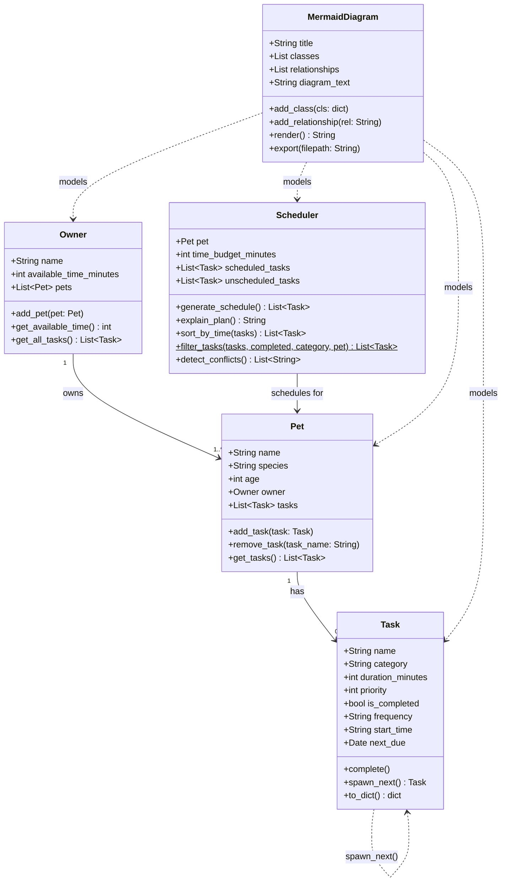

# PawPal+ Project Reflection

## 1. System Design

**a. Initial design**

Three core actions a user should be able to perform in PawPal+:

1. **Enter owner and pet information** — The user provides basic details about themselves and their pet. This information acts as the foundation for all scheduling decisions, since the amount of time available and the pet's needs directly constrain which tasks can be included in a given day.

2. **Add and edit care tasks** — The user can create tasks representing individual care activities (such as a morning walk, feeding, medication, grooming, or enrichment play). Each task carries at minimum a duration and a priority level so the scheduler knows how long it takes and how important it is relative to other tasks. 

3. **Generate and view a daily schedule** — The user triggers the scheduler, which takes the defined tasks and constraints and produces an ordered daily plan. The app displays the resulting schedule clearly and explains why tasks were included or excluded, helping the owner understand and trust the plan.

The system is built around five classes:

| Class | Attributes | Methods |
|---|---|---|
| `Owner` | `name`, `available_time_minutes`, `pets` | `add_pet()`, `get_available_time()` |
| `Pet` | `name`, `species`, `age`, `owner`, `tasks` | `add_task()`, `get_tasks()` |
| `Task` | `name`, `category`, `duration_minutes`, `priority`, `is_completed` | `complete()`, `to_dict()` |
| `Scheduler` | `pet`, `time_budget_minutes`, `scheduled_tasks`, `unscheduled_tasks` | `generate_schedule()`, `explain_plan()` |
| `MermaidDiagram` | `title`, `classes`, `relationships`, `diagram_text` | `add_class()`, `add_relationship()`, `render()`, `export()` |

**Relationships:**
- An `Owner` owns one or more `Pet` objects.
- A `Pet` holds a list of `Task` objects representing its care needs.
- A `Scheduler` is given a `Pet` and produces a filtered, prioritized daily plan.
- A `MermaidDiagram` composes any set of classes and relationships and renders them as diagram text.

**Class responsibilities:**

- **`Task`** (dataclass) — the atomic unit of pet care. It knows its own name, category, duration, and priority, and can mark itself completed or serialize itself to a dictionary. Keeping it a dataclass makes it easy to create, compare, and pass around.

- **`Pet`** (dataclass) — the subject of all care. It holds identity information (name, species, age) and owns the list of tasks that need to be done for it. It also carries a back-reference to its `Owner` so the scheduler can always trace from pet → owner → time budget.

- **`Owner`** — the constraint-holder. Its key responsibility is storing the total daily time available, which becomes the scheduler's budget. It also acts as the registration point for pets, enforcing the back-link between a pet and its owner.

- **`Scheduler`** — the decision-maker. Given a pet (and, transitively, its tasks and time budget), it sorts tasks by priority, fits as many as possible into the available time, and separates the rest into an unscheduled list. It also produces a plain-English explanation of its choices.

- **`MermaidDiagram`** — a design/documentation utility, not a runtime component. It accumulates class definitions and relationship strings and can render them into a valid Mermaid `classDiagram` block, or export that block to a Markdown file.

**Mermaid.js class diagram (final — updated to match implementation):**

**b. Design changes**

After reviewing the skeleton, two problems were identified and fixed:

1. **Added `Pet.remove_task()`** — The original design omitted a way to remove tasks from a pet. Since "add and edit tasks" is one of the three core user actions, deleting a task is essential. A `remove_task(task_name: str)` stub was added to `Pet` to close this gap.

2. **Made `Scheduler.time_budget_minutes` optional, defaulting to `pet.owner.available_time_minutes`** — In the original skeleton, the caller had to pass the time budget explicitly. This created a risk of the scheduler's budget silently diverging from the owner's actual available time. The constructor was changed to accept `Optional[int]`: if a value is supplied it is used as-is; otherwise it falls back to `pet.owner.available_time_minutes` (or 0 if no owner is set). This ties the two values together and eliminates the inconsistency.

---

## 2. Scheduling Logic and Tradeoffs

**a. Constraints and priorities**

The scheduler considers three constraints: (1) **total daily time** — the owner's `available_time_minutes` caps how many tasks can fit; (2) **priority** — tasks are sorted by their 1-based priority number so high-importance care (e.g., medication, walks) is always scheduled first; and (3) **completion status** — already-completed tasks are excluded from the current day's plan.

Priority was chosen as the primary sort key because pet health tasks (medication, feeding) are non-negotiable and must not be displaced by optional enrichment regardless of duration.

**b. Tradeoffs**

The conflict detector flags overlaps by comparing `start_time` + `duration_minutes` windows, but only for tasks that have an explicit `start_time` set. Tasks without a start time are silently skipped during conflict detection.

This is a reasonable tradeoff for this scenario: most users add rough start times for time-sensitive tasks (medication, walks) and leave discretionary tasks unscheduled. Requiring every task to have a time would create unnecessary friction. The tradeoff is that two unscheduled tasks could theoretically be placed back-to-back in a way that overruns the day — but the budget-based greedy scheduler already prevents that at the minute level. Exact-overlap detection (not just exact-time-match) is used, so 07:30 + 10 min correctly conflicts with 07:35, as shown in the demo.

---

## 3. AI Collaboration

**a. How you used AI**

I used VS Code Copilot throughout every phase of this project. In the early stages it was most useful for **design brainstorming** — asking "what attributes and methods should a Task class have for a pet scheduler?" helped me quickly enumerate candidates that I could then trim or extend. During implementation the **inline completions** (Tab key) were fastest for boilerplate such as dataclass fields and `pytest` fixture definitions. The most powerful feature for this project was **Copilot Chat's `#file` context**: attaching `pawpal_system.py` directly in the prompt let me ask precise questions like "Based on this Scheduler class, what edge cases should my conflict detector handle?" and get answers grounded in my actual code rather than generic suggestions.

The most helpful prompt patterns were:
- **Concrete + constrained** — "Write a pytest test that verifies `sort_by_time()` returns tasks in chronological HH:MM order. Use only the classes already defined in `pawpal_system.py`." Vague prompts like "write tests" produced too many irrelevant fixtures.
- **Explain then fix** — When a test failed I asked "Why is this test failing — is the bug in the test or in `generate_schedule()`?" before touching any code. Having Copilot reason first prevented me from chasing the wrong file.
- **UML → code** — "Based on this Mermaid diagram, generate Python class stubs" was a reliable way to turn design artifacts into skeleton files without manually transcribing each attribute.

**b. Judgment and verification**

When implementing `detect_conflicts()`, Copilot's first suggestion raised a Python `ValueError` exception when a conflict was found. I rejected this because exceptions are destructive in a UI context — a Streamlit app would crash and show an error screen rather than displaying a helpful warning message. I changed the design to return a `List[str]` of warning strings so the app can decide how to display them (in this case with `st.warning`). I verified the change by checking two properties: (1) the `main.py` demo printed the expected conflict strings without crashing, and (2) the `TestConflictDetection` tests confirmed the return type and message content.

---

## 4. Testing and Verification

**a. What you tested**

The 39-test suite covers five behavioral areas:

1. **Task lifecycle** — creation, `complete()` idempotence, and `to_dict()` key completeness. These matter because every other feature depends on Task state being correct.
2. **Pet task management** — add, remove, and count tasks. Removing a non-existent task must be safe (no exception), which guards against UI bugs where a user might double-click a delete button.
3. **Scheduler greedy-fit** — tasks that fit within the time budget are scheduled; tasks that don't go to `unscheduled_tasks`. A zero-budget edge case ensures the scheduler never schedules anything when the owner has no time.
4. **Sorting and filtering** — `sort_by_time()` returns chronological order and places tasks with no `start_time` last. `filter_tasks()` correctly partitions by completion status and category without mutating the original list.
5. **Recurrence** — `complete()` sets `next_due` to the correct date for daily and weekly tasks. `spawn_next()` returns a fresh incomplete copy. `generate_schedule()` automatically adds the spawned copy to the pet's task list.
6. **Conflict detection** — non-overlapping tasks produce no warnings; same start time and overlapping windows are each flagged; tasks with no `start_time` are correctly ignored.

These behaviors were prioritized because they are the paths a real user will hit in normal app use. If any one of them were silently wrong the schedule output could be meaningless or misleading.

**b. Confidence**

★★★★☆ (4/5). I'm highly confident in the backend logic because every core algorithm (greedy scheduler, recurrenece, conflict detection) has multiple targeted tests including edge cases. The one gap is the Streamlit UI layer — form interactions, session-state resets, and multi-pet ordering are not yet covered by automated tests. Next edge cases I'd test:
- An owner who has *no* pets registered — `get_all_tasks()` should return `[]` without error.
- A recurring task that has already been spawned twice — `generate_schedule()` should not keep multiplying tasks infinitely.
- Two tasks with identical priority but different durations — the relative order within the same priority level should be deterministic.

---

## 5. Reflection

**a. What went well**

The separation between the logic layer (`pawpal_system.py`) and the UI layer (`app.py`) worked extremely well. Because all scheduling intelligence lived in Python classes, I could test it entirely with `pytest` before touching Streamlit at all. This also meant that wiring the UI was mostly a matter of importing classes and calling methods — the UI code stayed thin and readable. The `@dataclass` choice for `Task` and `Pet` paid off significantly: frozen comparisons in tests, clean `__repr__` output for debugging, and free field-by-field equality checks all came for free.

**b. What you would improve**

If I had another iteration I would redesign the recurring-task system to store occurrences separately from the pet's base task list rather than appending copies back into `pet.tasks`. The current approach means the task list grows every time `generate_schedule()` is called after a recurring task is completed, which could cause duplicates across multiple schedule generations. A cleaner model would be a `TaskTemplate` (the recurring definition) that produces `TaskInstance` objects for specific dates, keeping the source-of-truth list clean.

**c. Key takeaway**

The most important lesson was that **AI accelerates production but not judgment**. Copilot could generate a working `detect_conflicts()` in seconds, but it couldn't decide whether conflicts should raise exceptions or return strings — that required me to think about the downstream UI contract and user experience. The same pattern repeated throughout: AI wrote the *how* quickly, but every decision about *what* the system should do in edge cases, and *why* a design was better than another, had to come from me. Being the "lead architect" means owning the specification, not just the keystrokes.
